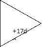
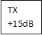
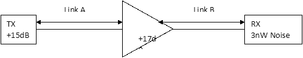
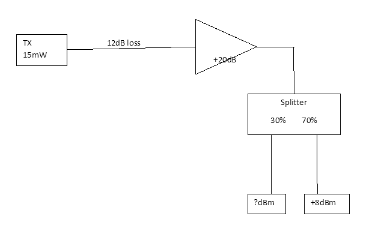

**Question 1 topics**

**Bit rate, baud rate, channel capacity, SNR, bandwidth, Modulation, Signals, waveforms, Analogue modulation, digital modulation, ASK, FSK, PSK, QAM, bandwidth, spectra, constellation diagrams.**

**2013 Summer**

**Q.1**

**a)**	Sketch the spectrum of the following signals

`	`i)	A sine wave described by y=3Sin(22000πt+π2)

`	`ii)	A 1kHz square wave

`	`iii)	A 1Mbps NRZ data stream

`	`In each case ensure that the frequency axis of the spectrum is clearly labelled.

**(6 marks)**

**b)**	Why does the baud rate and not the bit rate determine the required bandwidth for a digital signal? Use an analogy to support your answer.

**(4 marks)**

**c)**	A wireless data transmission system uses BFSK and a centre frequency at 800 kHz.  What bandwidth will be used to carry a data stream at 30kbps? Assume d = 0.5 and a guard band of 10 kHz is used between frequencies.   Draw the spectrum of the system output. 

**(5 marks)**

**d)**	Consider the following data transmission system

RX

3nW Noise

+17dB

TX

+15dBm

![ref1]![ref1]

The transmitter transmits +15dBm of signal power into link A.  Link A suffers a 95% power loss.  At the end of link A an amplifier with a gain of +17dB is used to boost the signal power before sending it on to link B.  Link B is 60km long with a loss of 0.4dB per km.  A receiver, which suffers from 3nW of noise at its input, is used to recover the signal at the end of link B.  Than bandwidth of the system is 20MHz.  

`	`i)	What is the expected signal power at the receiver?

ii)	What is the maximum theoretical data transmission capacity of the system?

**2012 Summer**

**Q. 1**

**a)**	Distinguish between the bit rate and the baud rate of a telecommunications system								**(6 marks)**

**b)**		Draw the constellation diagram for the following modulation schemes

`	`i)	ASK with peak amplitude values of 1V and 2V

`	`ii)	QPSK with a peak amplitude value of 5V and any suitable phases

iii)	8-QAM with 2 different amplitude values 1V and 3V and four different phases, π/4, 3π/4, 5π/4, 7π/4,

`	`Ensure that the axes of all diagrams are labelled to show signal amplitudes

`									`**(9 marks)**

**c)**	Consider the following data transmission system

TX

+15dBm

+17dB

RX

3nW Noise

The transmitter transmits +15dBm of signal power into link A.  Link A is 45km long with a power loss of 0.6dB per km.  At the end of link A an amplifier with a gain of +17dB is used to boost the signal power before sending it on to link B.  Link B is 60km long with a loss of 0.4dB per km.  A receiver, which suffers from 3nW of noise at its input, is used to recover the signal at the end of link B.  Than bandwidth of the system is 20MHz.  

`	`i)	What is the expected signal power at the receiver?

ii)	What is the maximum theoretical data transmission capacity of the system?

**(10 marks)**

**(Total 25 Marks)**
**

Question 2

a)	Explain the difference between an analog and a digital signal.  Give two examples of each.

b)	Explain the difference between a periodic and a nonperiodic signal.  Give two examples of each.

c)	A sine wave is described by yt=4.5sin(100t+π2rads).  Sketch the sine wave, clearly labelling each axis with appropriate units.

d)	A sine wave has a period of 0.65µs.  What is its frequency?

e)	A 260MHz sine wave is delayed by 120ps.  By how much is the phase shifted due to the delay?  Give your answer in both radians and degrees.

Question 3

a)		What is a carrier signal in the context of a wireless communications system?

b)	A radio wave has a wavelength of 25cm.  What is its frequency?

c)	A wireless channel has a bandwidth of 0.7MHz and a Signal to noise ratio of 35dB.  What type of QAM would you recommend using if you wanted to get the maximum possible data rate through the channel?

d)	Draw a constellation diagram for the following

`	`32 QAM

`	`QPSK

`	`ASK

e)	A 16QAM signal is running at 1.5MBaud.  Estimate the bandwidth assuming d = 1.

Question 4

a)		Draw the constellation diagram for the following modulation schemes

`	`i)	ASK with peak amplitude values of 1V and 3V

`	`ii)	QPSK with a peak amplitude value of 5V and any suitable phases

iii)	8-QAM with 2 different amplitude values 1V and 3V and four different phases, π/4, 3π/4, 5π/4, 7π/4,

`	`Ensure that the axes of all diagrams are labelled to show signal amplitudes

b)	Sketch the modulator output waveform for two of the 8-QAM constellation points in Question 2 part (a) above.  You must choose two points with different phases and sketch the two waveforms on the one set of axes.  Clearly label the axes and clearly identify the constellation point that each waveform represents.  Use a carrier frequency of 750MHz. 

c)	A telephone line has a 4kHz Bandwidth.  What is the maximum number of bits we can send using the following techniques.  Assume that the line has a sufficiently low noise level to carry the data without error.

`	`i)	ASK where d = 1

`	`ii)	QPSK where d = 0.5

`	`iii)	64-QAM where d = 1

Question 5

a)	Explain the difference between a baseband and a passband signal.  Give two examples of each.

b)	A periodic signal with period 23ps is travelling at a speed of 3 x 108 m/sec.  What is the wavelength of the signal?

c)	A system generates a square wave with a period of 3ms.  Sketch the frequency spectrum of the system output.

d)	An audio signal contains a band of frequencies from 20Hz to 20 kHz.  Sketch the signal in the frequency domain.

e)	A system generates a square wave with a period of 0.75ns.  All harmonics above the third harmonic are filtered out.  What is the bandwidth of the system output?

Question 6

a)	Define the bit rate and the baud rate for a system

b)	A system transmits at a bit rate of 1Gbps using 16 signalling levels per symbol.  What is the baud rate?

c)	A low pass channel has a bandwidth of 200kHz.  What is the maximum bit rate of this channel?

d)	What are the main sources of transmission impairment.

e)	A data transmission system launches 45mW of power into a cable.  The cable is 22km in length and has a loss of 2.5dB/km.  What is the power level at the end of the cable?  

Practice Questions

Question 7

a)	Consider the following data transmission system

TX

15mW

+20dB

Splitter

30%        70%

a)	Determine the power at the 30% output arm of the splitter.

b)	What causes a signal to become distorted in a data communications system?  Use a diagram to illustrate your answer.

c)	If a receiver was connected to the 30% output arm of the splitter and the receiver noise level was 2nW what would be the maximum theoretical data transmission capacity of the system?

d)	A data communications system uses 16 QAM to send data through a noiseless channel with a bandwidth of 200kHz.  What is the maximum practical capacity of the channel if the system is using 16QAM?

e)	How many signalling levels would be required to send a 2Mbps data stream through a channel with a bandwidth of 400kHz?

Question 8

1) A telephone line has a bandwidth of 3500Hz and a Signal to Noise Ratio of 28dB.  What is the capacity of the channel?

   b)	What signal to noise ratio would be required to send a 1MB/sec data stream through a channel with a bandwidth of 100kHz?	  

   c)	A channel has a bandwidth of 2.5MHz and a Signal to noise ratio of 200,000.  How many signalling levels should be used to achieve the maximum data rate through this channel?  What is this maximum data rate?

   d)	What is the difference between the bandwidth and the throughput of a data communications system?

   e)	A 3kByte message is sent at 2Gbps through a 5,000km cable.  The propagation speed is 2.4 x 108 m/sec.  How long will it take for the entire message to arrive at the receiver?

Question 9

a)	How many bits can fit on a 1.5km link if the propagation speed is 2.4 x 108 m/sec and the bit rate is 25MB/sec?

b)	What is line coding?

c)	Why are the data rate and the signal rate sometimes different in a baseband communications system?

d)	Digital receivers can suffer from baseline wandering.  What is baseline wandering and how can it be avoided?

e)	Explain why synchronisation between the sender and receiver is important in a baseband communications system.  What can happen if synchronisation is lost?

Question 10

a)	Compare NRZ, NRZ-L and NRZ-I line coding schemes in terms of base line wandering and synchronisation.

b)	Why do some line coding schemes result in DC components whereas others do not?

c)	What would be the effect of a loss of synchronisation between a transmitter and receiver in a digital transmission system?

d)	A data transmission scheme is to transmit the following data stream.

`		`011100101000

`	`Assume the last signal level has been positive.  Draw the graph of the output signal for the following coding schemes

`		`NRZ-L

`		`NRZ-I

`		`Manchester

`		`Differential Manchester

`		`AMI

`		`Pseudoternary

Question 11

a)	Why does a Manchester coded data stream occupy more bandwidth than an NRZ-L data stream of the same data rate?

b)	What advantages do multilevel coding schemes offer over simple polar or bipolar schemes?

c)	How many levels does the 2B1Q coding scheme have?

d)	Given the following transition table, draw the graph of the output signal for the data stream 1100100001.  Assume the last signal level has been negative.

[ref1]: Aspose.Words.ac4770eb-c9b2-4646-b285-f1239799c7aa.006.png
