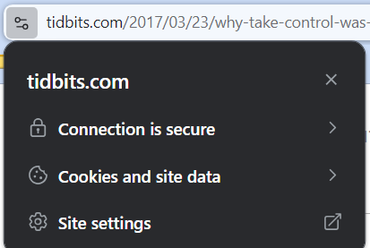
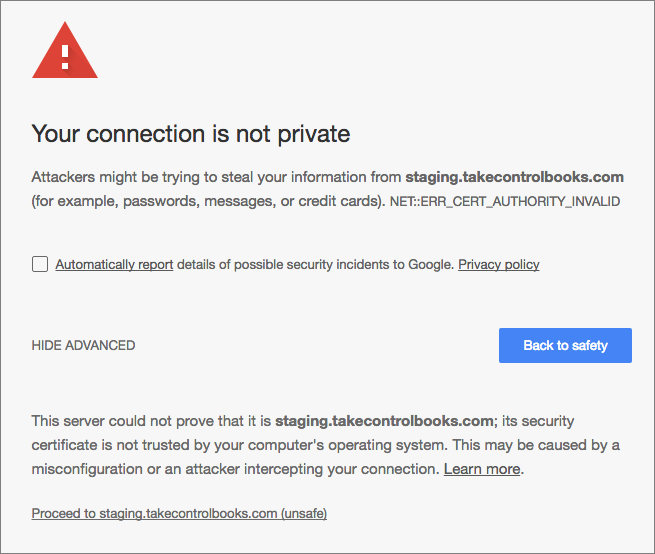
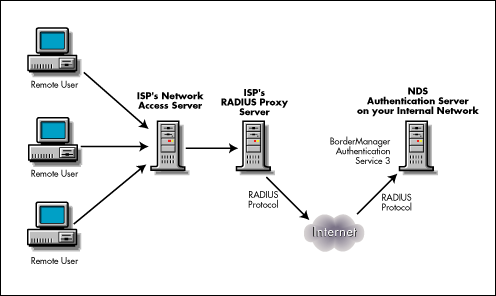
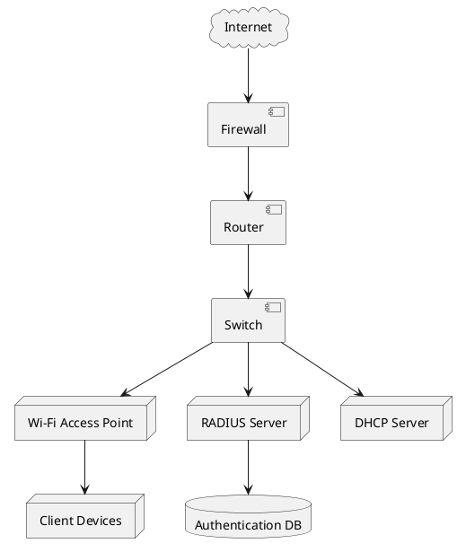
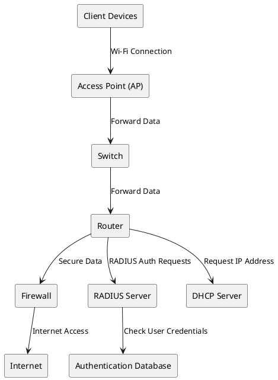

# Server Admin: Services - HNET07017 - Exam Paper - 2023 - Winter

## Instructions

**Time Allowed:** 2 hours  

**Instructions:** Answer 4 questions. All questions carry equal marks.  

The use of programmable or text storing calculators is expressly forbidden.  

Please note that where a candidate answers more than the required number of questions, the examiner will mark all questions attempted and then select the highest scoring ones.

**Exam Materials to accompany this paper:**  

- The use of a maximum of 2 single sided A4 sized pages of personal notes is permitted. Notes may include text, formulae and diagrams and must be typed in font no smaller than 10 points.

**Requirements for this paper:**  

1. Log Tables
2. Calculators

## Question 1 [Total Marks: 25]

Explain the purpose of the following Windows Server 2022 related concepts:

### Question 1.A (5 Marks)

Server hardening

### Answer 1.A

Server hardening is the process of securing a server by reducing its attack surface. This is done by removing unnecessary services, closing ports, and applying security patches. Server hardening is essential to protect the server from cyber attacks and data breaches.

Example: Turn off Remote Desktop Protocol (RDP) if not needed and block port 3389.

### Question 1.B (5 Marks)

Server mirroring

### Answer 1.B

Server mirroring is the process of creating an exact copy of a server's data and configuration on another server. This is done to ensure high availability and fault tolerance. In case the primary server fails, the mirrored server can take over seamlessly, minimizing downtime.

### Question 1.C (5 Marks)

Load balancing

### Answer 1.C

Load balancing is the process of distributing network traffic across multiple servers to ensure optimal resource utilization, maximize throughput, minimize response time, and avoid overload. Load balancing improves the performance, availability, and reliability of servers.

### Question 1.D (5 Marks)

Server updates

### Answer 1.D

Server updates are software patches released by the server vendor to fix security vulnerabilities, improve performance, and add new features. Regularly updating servers is crucial to protect them from cyber threats and ensure smooth operation.  A cavite is that updates should be tested before deployment to avoid compatibility issues or you may end up with a system failure like that caused by the CrowdStrike patch on July 19, 2024.

### Question 1.E (5 Marks)

Server manager

### Answer 1.E

Server Manager is a Windows Server tool that allows administrators to manage multiple servers from a single console. It provides a centralized interface to configure server roles and features, monitor server performance, and perform administrative tasks. Server Manager simplifies server management and reduces the complexity of managing multiple servers.

## Question 2 [Total Marks: 25]

### Question 2.A (5 Marks)

State FIVE roles of a Windows 2022 server.

### Answer 2.A

1. File Server: Provides file storage and sharing services to users on the network.
2. Domain Controller: Manages user accounts, permissions, and security policies in a Windows domain.
3. Web Server: Hosts websites and web applications accessible over the internet or intranet.
4. DNS Server: Resolves domain names to IP addresses and vice versa.
5. DHCP Server: Automatically assigns IP addresses to devices on the network.
6. Print Server: Manages printers and print jobs on the network.
7. Application Server: Hosts and runs applications for client devices.
8. Remote Desktop Services: Allows remote access to desktops and applications over the network.

### Question 2.B (5 Marks)

Explain the process of setting up a Microsoft Windows 2022 web service.

### Answer 2.B

To set up a Microsoft Windows 2022 web service, follow these steps:

1. Install IIS (Internet Information Services), Open Server Manager, click on Manage, and select Add Roles and Features. Choose Web Server (IIS) as the role to install.
2. Configure IIS, Open IIS Manager, create a new website, specify the site name, physical path, and binding information (IP address, port, host name).
3. Install and configure web applications, upload the website files to the server, configure application pools, and set permissions.
4. Test the website, open a web browser, enter the server's IP address or domain name, and verify that the website is accessible.
5. Secure the website, enable HTTPS, configure SSL certificates, and apply security best practices to protect the site from cyber threats.
6. Monitor and maintain the website, regularly check server logs, performance metrics, and update the website content as needed.
7. Backup and disaster recovery, regularly back up the website files, databases, and configuration settings to prevent data loss in case of server failure.

### Question 2.C (5 Marks)

What is the difference between setting up an http and an https website?

### Answer 2.C

The main difference between setting up an HTTP and an HTTPS website is the security level provided by each protocol:

1. HTTP (Hypertext Transfer Protocol): It is the standard protocol for transmitting data over the internet. HTTP websites are not encrypted, making them vulnerable to eavesdropping and data interception. HTTP websites are suitable for non-sensitive information and do not require an SSL certificate.
2. HTTPS (Hypertext Transfer Protocol Secure): It is an extension of HTTP with added security features. HTTPS websites use SSL/TLS encryption to secure data transmission between the server and the client. HTTPS websites display a padlock icon in the browser address bar, indicating a secure connection. HTTPS is essential for protecting sensitive information, such as login credentials, payment details, and personal data.
3. Setting up an HTTPS website requires obtaining an SSL certificate, configuring the web server to use HTTPS, and redirecting HTTP traffic to HTTPS. HTTPS websites provide data integrity, authentication, and confidentiality, ensuring secure communication between users and the server.
4. In summary, HTTP websites are unencrypted and insecure, while HTTPS websites are encrypted and secure, protecting user data from cyber threats.

### Question 2.D (5 Marks)

How would a user determine if a website is 'secure'?

### Answer 2.D

A user can determine if a website is 'secure' by checking for the following indicators:

1. SSL/TLS certificate: Look for a padlock icon in the browser address bar or a green address bar, indicating that the website is using HTTPS and has a valid SSL/TLS certificate. Click on the padlock icon to view the certificate details.

2. HTTPS connection: Check the URL prefix, a secure website starts with 'https://' instead of 'http://'. The 's' stands for secure, indicating that the data transmitted between the user and the server is encrypted.
3. Browser warnings: Modern browsers display warnings for insecure websites, such as 'Not Secure' or 'Connection is not secure', alerting users to potential security risks. Users should avoid entering sensitive information on such sites. 

### Question 2.E (5 Marks)

Illustrate how an alias DNS record may be helpful in creating a user-
friendly URL?

### Answer 2.E

An alias DNS record can be helpful in creating a user-friendly URL by allowing multiple domain names to point to the same web server or website. This is achieved by creating a CNAME (Canonical Name) record that maps an alias domain name to the primary domain name. When a user enters the alias domain name in the browser, the CNAME record redirects the request to the primary domain, displaying the same content.

Example: Google protects its users from phishing attacks by using an alias DNS record for its URL shortener service. When a enters a misspelled
 URL (e.g., gogle.com), the CNAME record redirects the request to the primary domain (e.g., <https://www.google.com>), ensuring a seamless user experience.

Alias Domain: [gogle.com](https://gogle.com)  
Primary Domain: [google.com](https://www.google.com)

## Question 3 [Total Marks: 25]

### Question 3.A (10 Marks)

Explain the key benefits of using a Radius server to connect your wireless access points to the network in a medium to large sized SME campus network.

### Answer 3.A

A RADIUS (Remote Authentication Dial-In User Service) server provides centralized authentication, authorization, and accounting services for network devices, such as wireless access points, in a medium to large-sized SME campus network. The key benefits of using a RADIUS server include:

1. Centralized Authentication: RADIUS allows users to authenticate using a single set of credentials across multiple network devices. This simplifies user management and enhances security by enforcing strong authentication policies.
2. Authorization: RADIUS controls user access to network resources based on predefined policies and user roles. Administrators can define access permissions, VLAN assignments, and security settings for different user groups.
3. Accounting: RADIUS tracks user activity, session duration, and data usage for auditing and billing purposes. This helps organizations monitor network usage, enforce usage policies, and generate reports on user activity. *Example: Students use of the printer can be tracked and billed to their accounts.*  
4. Wireless Security: RADIUS supports advanced security protocols, such as WPA2-Enterprise and 802.1X, to secure wireless networks. It encrypts user credentials, authenticates users before granting network access, and protects data transmission from eavesdropping.

### Question 3.B (15 Marks)

Illustrate the devices needed to enable a Radius supported Wi-Fi service, and the configuration process, in a medium to large sized SME campus network.

Include a simple topology diagram in your answer.

### Answer 3.B

***DOUBLE CHECK THIS ANSWER***

To enable a RADIUS-supported Wi-Fi service in a medium to large-sized SME campus network, the following devices are needed:

1. Wireless Access Points (WAPs): Deploy WAPs throughout the campus to provide wireless network coverage. WAPs connect wireless devices to the network and support Wi-Fi connectivity.
2. RADIUS Server: Install a RADIUS server on the network to handle user authentication, authorization, and accounting. The RADIUS server acts as a central authentication server for network devices.
3. Network Switches: Connect WAPs and other network devices to the network switches to facilitate data transmission. Switches provide network connectivity and manage traffic flow.
4. User Devices: Users' laptops, smartphones, and tablets connect to the Wi-Fi network using WPA2-Enterprise security and 802.1X authentication.
5. Network Security Appliances: Firewalls, intrusion detection systems (IDS), and intrusion prevention systems (IPS) protect the network from cyber threats and unauthorized access.

> https://cyberhoot.com/cybrary/radius-authentication/

## Question 4 [Total Marks: 25]

### Question 4.A (10 Marks)

What are FIVE key considerations and best practices that should be considered when designing and implementing a server backup strategy for a large-scale enterprise network?

### Answer 4.A

Designing and implementing a server backup strategy for a large-scale enterprise network requires careful planning and adherence to best practices to ensure data integrity, availability, and disaster recovery. Here are five key considerations and best practices for a robust server backup strategy:

1. **Define Backup Objectives and Requirements**
   - **Data Criticality**: Determine which data and applications are critical to the business and require regular backups. Prioritize backups based on their importance and recovery needs.
   - **Recovery Point Objective (RPO)**: Define the maximum acceptable amount of data loss measured in time. This will guide the frequency of backups (e.g., hourly, daily).
   - **Recovery Time Objective (RTO)**: Establish the maximum acceptable downtime for each system or application. This will influence the choice of backup technologies and strategies.
2. **Implement a Multi-Layered Backup Approach**
   - **Full Backups**: Perform regular full backups to ensure a complete snapshot of all data. Full backups are essential for a reliable recovery point.
   - **Incremental and Differential Backups**: Use incremental or differential backups to reduce storage requirements and backup times. Incremental backups capture changes since the last backup, while differential backups capture changes since the last full backup.
   - **Offsite and Cloud Backups**: Ensure that backups are stored offsite or in the cloud to protect against local disasters such as fires or floods. Cloud backups offer scalability and remote access, enhancing disaster recovery.
3. **Automate and Schedule Backups**
   - **Automation**: Implement backup automation to reduce the risk of human error and ensure backups are performed consistently according to the defined schedule.
   - **Scheduling**: Schedule backups during off-peak hours to minimize impact on system performance and network bandwidth. Adjust schedules based on the backup type and data change frequency.
4. **Regular Testing and Verification**
   - **Test Restores**: Regularly test backup restores to verify that backups are valid and can be used to restore data accurately. Perform test restores on a regular basis, not just during the initial setup.
   - **Monitor and Report**: Implement monitoring and reporting tools to track the success and failure of backup jobs. Set up alerts for failed backups or issues that require attention.
5. **Security and Encryption**
   - **Data Encryption**: Encrypt backup data both in transit and at rest to protect against unauthorized access and data breaches. Ensure encryption keys are managed securely.
   - **Access Controls**: Restrict access to backup data and backup systems to authorized personnel only. Implement strong authentication and authorization measures to protect backup environments.

**Summary:**

A successful server backup strategy for a large-scale enterprise network requires a well-defined plan that includes setting clear objectives, using a multi-layered backup approach, automating and scheduling backups, regularly testing and verifying backups, and implementing strong security measures. These practices help ensure data integrity, minimize downtime, and protect against various types of data loss or disaster scenarios.

### Question 4.B (15 Marks)

Provide specific examples of backup methods and technologies that can be utilized to ensure data integrity, availability, and disaster recovery.

### Answer 4.B

Incorporating the specific backup methods and technologies mentioned in your course materials, here are examples of backup strategies and technologies that can be utilized to ensure data integrity, availability, and disaster recovery:

1. **Windows Server Backup**: This built-in utility in Windows Server 2022 allows for scheduled backups of the system state, volumes, and individual files. It supports both full and incremental backups. This tool is useful for creating reliable backups directly within the Windows Server environment. Detailed setup instructions are available in the [Windows Server 2022 - Backup service tutorial](https://4sysops.com/archives/install-and-configure-windows-server-backup-in-windows-server-2022/).

2. **Veeam Backup & Replication**: Veeam offers comprehensive backup solutions that include full, incremental, and differential backups. It provides advanced features like continuous data protection (CDP) and replication, which are beneficial for ensuring minimal data loss and quick recovery. Veeam's capabilities are demonstrated in the [Veeam - Windows backup tutorial](https://www.youtube.com/watch?v=i05O4ZBbNpo).

3. **Backup-as-a-Service (BaaS)**: Cloud-based backup solutions, such as those provided by Microsoft Azure, offer offsite backup storage and management without needing on-premises infrastructure. These services scale easily and provide robust disaster recovery options. For instance, [Microsoft Azure Backup](https://azureforeducation.microsoft.com/devtools) integrates seamlessly with various backup technologies.

4. **Tape Backup**: Traditional tape backup solutions, such as those from IBM or HPE, offer cost-effective, long-term storage for large volumes of data. Although slower compared to disk-based solutions, tapes are ideal for archival purposes due to their durability and low cost. Tape systems like **IBM TS4500** are widely used for their reliability.

5. **Snapshot-Based Backup**: Technologies such as VMware vSphere snapshots capture the state of virtual machines at specific points in time. Snapshots are useful for quick recovery and minimal downtime. They are often used in conjunction with other backup methods to enhance data protection. You can find more about setting up such snapshots in VMware IT Academy resources or similar guides.

6. **Cloud Backup Solutions**: Services like Amazon Web Services (AWS) Backup offer scalable cloud backup solutions with features like automated backup management, secure storage, and global access. Cloud backups are essential for protecting data against local failures and providing remote disaster recovery options.

7. **Backup Appliances**: Devices such as the Dell EMC Data Domain or Commvault’s backup appliances offer integrated solutions for disk-based backups with deduplication capabilities. These appliances improve backup efficiency and reduce storage requirements.

By leveraging these backup methods and technologies, enterprises can achieve robust data protection, ensure availability, and implement effective disaster recovery strategies. Each technology serves different needs, from quick local backups to comprehensive cloud-based solutions, catering to various recovery objectives and data protection requirements.

## Question 5 [Total Marks: 25]

### Question 5.A (10 Marks)

What are FIVE main security risks associated with providing remote server access to users or administrators in a corporate network environment?

### Answer 5.A

Providing remote server access in a corporate network environment exposes several security risks:

1. **Unauthorized Access**: Remote access can potentially be exploited by unauthorized users if strong authentication and access controls are not in place. This can lead to unauthorized manipulation or theft of sensitive data.

2. **Data Interception**: Without proper encryption, data transmitted between the remote user and the server can be intercepted by attackers. This exposes sensitive information to eavesdropping and potential compromise.

3. **Malware and Ransomware**: Remote access can be a vector for malware or ransomware attacks if remote devices are compromised or not secured. Attackers can exploit remote sessions to deploy malicious software or encrypt files for ransom.

4. **Weak Authentication**: Using weak or easily guessable passwords can make remote access vulnerable to brute-force attacks or credential stuffing. This weakens the overall security posture and increases the risk of unauthorized access.

5. **Lack of Monitoring and Logging**: Without proper monitoring and logging of remote access activities, it becomes challenging to detect and respond to suspicious behavior or security incidents. This can lead to undetected breaches and prolonged exposure.

### Question 5.B (15 Marks)

Discuss THREE recommended security measures that can be implemented to mitigate these risks while ensuring efficient and secure remote server access.

### Answer 5.B

To mitigate the security risks associated with remote server access, the following measures should be implemented:

1. **Implement Multi-Factor Authentication (MFA)**: Multi-factor authentication adds an extra layer of security by requiring users to provide multiple forms of verification before accessing the server. This significantly reduces the risk of unauthorized access even if passwords are compromised. Implementing MFA ensures that remote users must authenticate using something they know (password) and something they have (e.g., a mobile authentication app or hardware token).

2. **Use VPNs and Secure Protocols**: Enforce the use of Virtual Private Networks (VPNs) to secure the communication channel between remote users and the corporate network. VPNs encrypt data in transit, making it much harder for attackers to intercept and read the data. Additionally, use secure protocols like SSH (Secure Shell) for administrative access and HTTPS (Hypertext Transfer Protocol Secure) for web-based management to ensure encryption of data transmitted over the network.

3. **Regularly Monitor and Audit Remote Access**: Implement comprehensive monitoring and logging mechanisms to keep track of all remote access activities. Regularly review logs and audit trails to detect unusual behavior or potential security incidents. Setting up alerts for suspicious activities and conducting periodic security assessments can help in identifying and mitigating threats before they escalate.

By adopting these measures, organizations can enhance the security of remote server access, reduce the risk of unauthorized access and data breaches, and ensure a secure and efficient remote working environment.

## Question 6 [Total Marks: 25]

### Question 6.A (10 Marks)

Explain the role of DHCP in dynamically assigning IP addresses to devices on a network.

### Answer 6.A

DHCP (Dynamic Host Configuration Protocol) automates the process of assigning IP addresses to devices on a network, simplifying network management. When a device connects to the network, it sends a DHCP request to obtain an IP address. The DHCP server responds with an IP address and other network configuration details, such as the subnet mask, default gateway, and DNS servers. This process involves several key steps:

1. **Discovery**: The client device sends a broadcast message to locate a DHCP server.
2. **Offer**: The DHCP server responds with an offer that includes an IP address and configuration parameters.
3. **Request**: The client device requests the offered IP address.
4. **Acknowledge**: The DHCP server confirms the allocation and provides the IP address and configuration details.

This dynamic assignment ensures that IP addresses are allocated efficiently, avoiding conflicts and reducing manual configuration efforts.

### Question 6.B (15 Marks)

Discuss THREE advantages and THREE potential challenges associated with using DHCP in managing IP address allocation within an organization's network infrastructure.

### Answer 6.B

Using DHCP for managing IP address allocation comes with several advantages and potential challenges:

**Advantages:**

1. **Simplified Network Management**: DHCP automates the IP address assignment process, reducing the need for manual configuration and management of IP addresses. This simplifies network administration, especially in large networks where managing IP addresses manually would be cumbersome.

2. **Efficient IP Address Utilization**: DHCP helps in managing IP addresses efficiently by reusing addresses that are no longer in use. It allocates IP addresses dynamically, ensuring that available addresses are assigned to devices as needed, which can optimize the use of a limited pool of IP addresses.

3. **Centralized Configuration**: With DHCP, network configuration parameters such as IP addresses, subnet masks, and DNS servers are managed centrally on the DHCP server. This centralization ensures consistent configuration across all devices, which can enhance network reliability and ease troubleshooting.

**Challenges:**

1. **Single Point of Failure**: The DHCP server represents a single point of failure. If the DHCP server becomes unavailable, devices may be unable to obtain IP addresses, leading to network connectivity issues. Implementing DHCP failover or redundancy solutions can mitigate this risk but adds complexity.

2. **Security Risks**: DHCP can be vulnerable to security risks such as DHCP spoofing attacks, where an attacker mimics a legitimate DHCP server to intercept network traffic or assign malicious configurations. Implementing DHCP snooping and other security measures can help protect against these threats.

3. **IP Address Conflicts**: Although DHCP aims to prevent IP address conflicts, issues can arise if the DHCP server is misconfigured or if there are multiple DHCP servers on the same network without proper coordination. Address conflicts can occur if two devices are assigned the same IP address, leading to connectivity problems. Ensuring proper network design and server configuration can help reduce these risks.

## Paper Metadata

43dcf00e

12 2024
11-01-2024 - 14:00

MODULE:

PROGRAMME(S):
LC_KCSYM_KMY

YEAR OF STUDY:

EXAMINER(S):

TUS
Technological University of the Shannon:
Midands Midwest
Ollscoil Teicneolalochta na Sionainne:
Lar Tire larthar Lair

TECHNOLOGICAL UNIVERSITY OF THE SHANNON: MIDLANDS MIDWEST
AUTUMN REPEAT EXAMINATIONS 2023/2024

HNET07017 - Server Admin: Services

Bachelor of Science (Honours) Computer Networks and
Systems Management

Michael Winterbum
Fernando Perez-Tellez

(Internal)
(External)

TIME ALLOWED:

INSTRUCTIONS:

TWO HOURS

Answer 4 questions. All questions carry equal marks.

PLEASE DO NOT TURN OVER THIS PAGE UNTIL YOU ARE INSTRUCTED TO DO SO.
The use of programmable or text storing calculators is expressly forbidden.
Please note that where a candidate answers more than the required number of questions, the
examiner will mark all questions attempted and then select the highest scoring ones.

There are no additional requirements for this paper.

HNET07017 - Server Admin: Services
Autumn Repeat Examinations 2023/2024

Page 1 of
