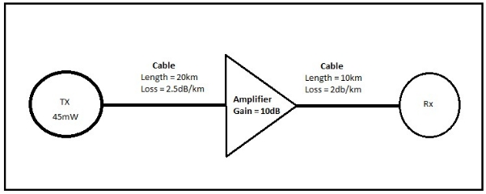


# **TECHNOLOGICAL UNIVERSITY OF THE SHANNON: MIDLANDS MIDWEST**

## WINTER EXAMINATIONS

| **MODULE:**  **PROGRAMME(S):**          | CONE07001-Data Comms                                     |
|:----------------------------------------|:---------------------------------------------------------|
| LC_KNSMM_KMY                            | B.Sc. (Honours) Computer Networks and Systems Management |
|                                         |                                                          |
| **YEAR OF STUDY:**  ** **EXAMINER(S):** | 3                                                        |
| **TIME ALLOWED:**                       | **2.5 HOURS**                                            |
| **INSTRUCTIONS:**                       | **Answer 4 questions. All questions carry equal marks.** |

**Additional Attachments or Exam Material to accompany this paper:**
**

**A.** The use of a maximum of 2 single sided A4 sized pages of personal notes is permitted. Notes may include text, formulae and diagrams and must be typed in font no smaller than 10 points.

**PLEASE DO NOT TURN OVER THIS PAGE UNTIL YOU ARE INSTRUCTED TO DO SO.**

The use of programmable or text storing calculators is expressly forbidden.

Please note that where a candidate answers more than the required number of questions, the examiner will mark all questions attempted and then select the highest scoring ones.

**Requirements for this paper:**  

1. Log Tables
2. Calculators

## Question 1 [Total Marks: 25]

### Question 1(a) [4 Marks]

Explain the difference between an analogue and a digital signal.  Give two examples of each.

### Question 1(b) [7 Marks]

A sine wave is described by:

$$y(t) = 2sin(6284t + \frac{\pi}{4}\text{rads})$$

Sketch the sine wave, clearly labelling each axis with appropriate units.

### Question 1(c) [6 Marks]

If the sine wave in part (b) above was sampled at 10kHz, what would be the first 3 sample values?

### Question 1(d) [8 Marks]

A system generates a 2V peak to peak square wave with a period of 1ms.  Sketch the frequency spectrum of the system output.

## Question 2 [Total Marks: 25]

### Question 2(a) [4 Marks]

Explain the difference between the bit rate and the baud of a system

### Question 2(b) [5 Marks]

A system transmits at a bit rate of 1Gbps using 16 signalling levels per symbol.  What is the baud of the system?

### Question 2(c) [4 Marks]

A low pass channel has a bandwidth of 200kHz.  Assuming zero noise, what is the maximum capacity of this channel?

### Question 2(d) [12 Marks]

>Figure 2(d) – Transmission system

A data transmission system launches 45mW of power into a cable from transmitter, TX.  The cable is 20km in length and has a loss of 2.5dB per kilometre.  The signal is then amplified using an amplifier with 10db gain before being transmitted via a second cable of length 10km with a loss of 2dB per kilometre. What is the received power level in watts at Rx?

## Question 3 [Total Marks: 25]

### Question 3(a) [10 Marks]

Draw the constellation diagram for the following modulation schemes:

1. ASK with peak amplitude values of 1V and 3V.
2. QPSK with a peak amplitude value of 1V and any suitable phases.

Ensure that the axes of all diagrams are labelled to show signal amplitudes.

### Question 3(b) [6 Marks]

How many bits can fit on a 1.5km link if the propagation speed is 2.4 x $10^{8}$ m/sec and the bit rate is 25Mb/sec? 

### Question 3(c) [9 Marks]

A data transmission scheme is to transmit the following binary data stream:  

$$01 \ 1100\ 1010$$

Assume the last signal level has been positive.  Draw the graph of the output signal for the following coding schemes:

1. Manchester
2. AMI
3. NRZ-L

## Question 4 [Total Marks: 25]

### Question 4(a) [4 Marks]

What is the main advantage of Return to Zero (RZ) line coding schemes, for example Manchester Encoding, over Non-Return to Zero (NRZ) line coding schemes such as NRZ-I?  How is this advantage achieved?

### Question 4(b) [2 Marks]

Calculate the RMS Voltage of the following sine wave:  

$$V(t) = 312sin(314t + 1.1\text{rad})$$

### Question 4(c) [9 Marks]

Write brief notes explaining any **three** of the following wireless terms:

1. Atmospheric absorption
2. Multipath
3. Reflection
4. Scattering
5. Inter-symbol interference (ISI)

### Question 4(d) [10 Marks]

A dish antenna operates at 2.4GHz with a gain of 7.1dBi. Calculate the effective area of the antenna.

## Question 5 [Total Marks: 25]

### Question 5(a) [2 Marks]

Explain the meaning of the term "antenna reciprocity".

### Question 5(b) [5 Marks]

Explain the term counterpoise as used in antenna design and outline how one could be constructed.

### Question 5(c) [10 Marks]

Calculate the bandwidth of a 10mm x 12mm planar antenna.

### Question 5(d) [5 Marks]

Calculate the effective (or radio) line of sight for two antennas mounted on 10m high masts.

### Question 5(e) [3 Marks]

List and briefly explain three LOS wireless transmission impairments.

---
